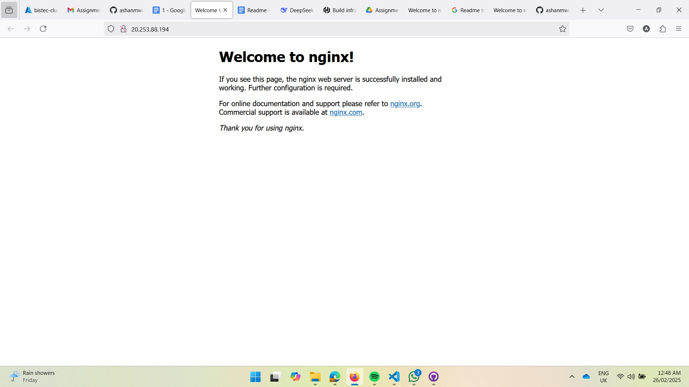
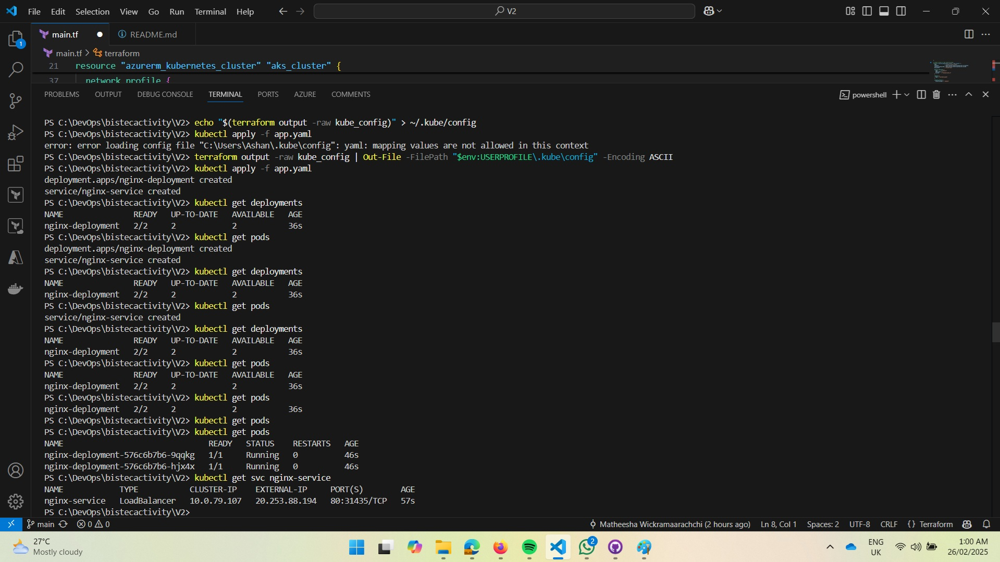
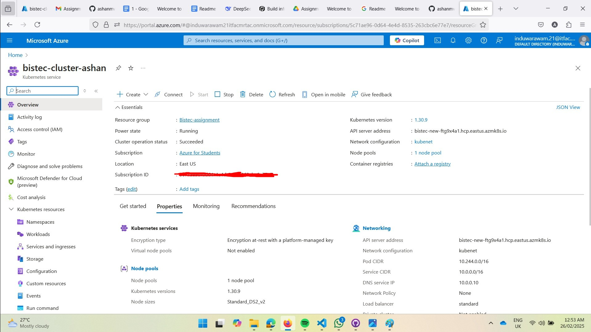

## 1. Authenticate with Azure CLI
Pls Use PowerShell
Sense

1. Azure CLI authenticate with Azure Enter:

    ```bash
    az login
    ```
    
2. Select your account and login & Select Tenant & subscription in terminal(this will return subscription-id)

3. Set the subscription for the session:

    ```bash
    az account set --subscription "<subscription-id>"
    ```

4. Get account details such subscription ID


    ```bash
    az account show
    ```

## 2. Set Service Permission and Set Environment Variables

1. To set permissions with role for subscription:

    ```bash
    az ad sp create-for-rbac --role="Contributor" --scopes="/subscriptions/<subscription-id>"
    ```

   this will return app_id,display_name,password,tenant which needed:

   - `app_id`
   - `display_name`
   - `password`
   - `tenant`

2. Set environment variables Enter as bellow:

    ```bash
    $Env:ARM_CLIENT_ID = "<app_id>"
    $Env:ARM_CLIENT_SECRET = "<password>"
    $Env:ARM_SUBSCRIPTION_ID = "<subscription-id>"
    $Env:ARM_TENANT_ID = "<tenant>"
    ```

## 3. Terraform Setup

1. Create Folder for project and navigate to it.

2. To save kubernetes config file Enter:

    ```bash
    terraform output -raw kube_config | Out-File -FilePath "$env:USERPROFILE\.kube\config" -Encoding ASCII
    ```

3. Create a `main.tf` and add script as given.

4. To initialize terraform Enter:

    ```bash
    terraform init
    ```

5. To output execution plan:

    ```bash
    terraform plan
    ```

6. To apply apply the configuration to Azure Enter:

    ```bash
    terraform apply
    ```

## 4. Kubernetes Deployment

1. Create a `app.yaml` file and add script as given.

2. To Deploy app on kubernetes Enter:

    ```bash
    kubectl apply -f app.yaml
    ```

3. To check deployment state:
    ```bash
    kubectl get deployments
    ```

4. To check status of pods:
    ```bash
    kubectl get pods
    ```

5. To Get external ip of the application:
    ```bash
    kubectl get svc nginx-service
    ```
## 5. Access Application

Deployed External IP- http://20.253.88.194/

For indepth Document on Deploymnet with Scrrenshots visit

https://docs.google.com/document/d/14HGwQafrvYKWducVTnU9aF7-zXII0pVnqtunplt8sxk/edit?usp=sharing

## 6. Screen Shots






## 6. Sensitive Data Handling
For security reasons, sensitive data such as API keys, passwords, and secrets have been Removed

